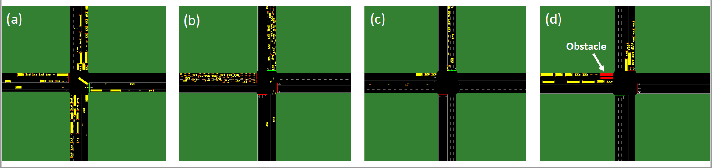
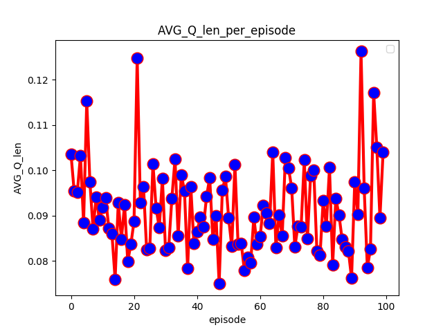
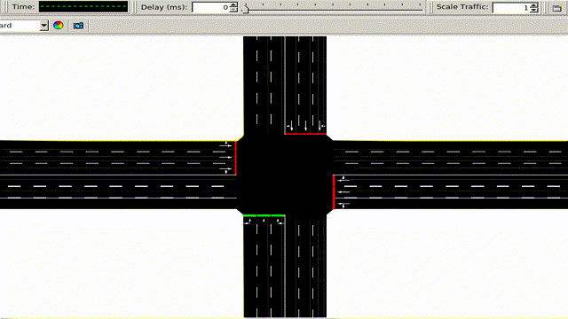
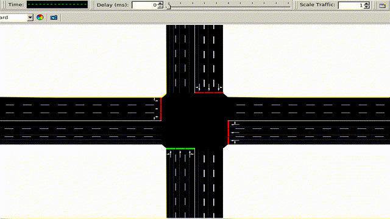
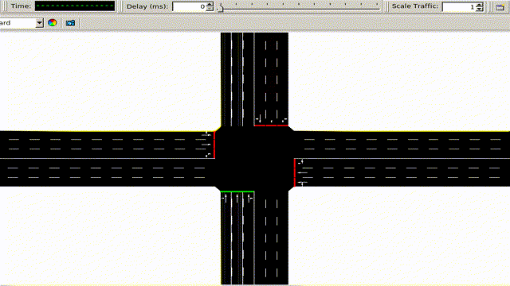
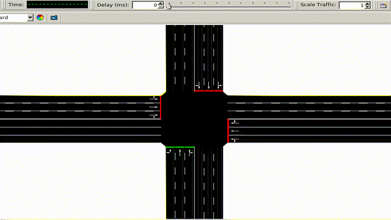
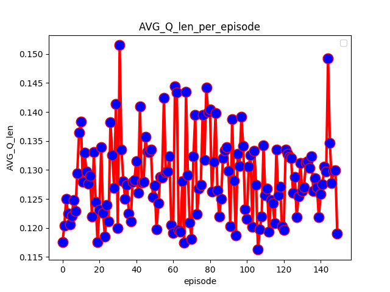
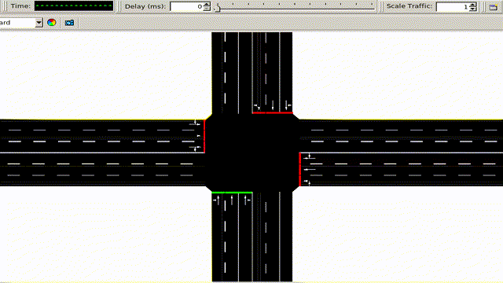
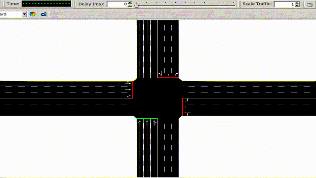

# Smart-Traffic-Signals
Smart Traffic Signals with PARL  
创意赛5星环境：交通信号灯控制  
原开源项目：https://github.com/Ujwal2910/Smart-Traffic-Signals-in-India-using-Deep-Reinforcement-Learning-and-Advanced-Computer-Vision  

Requirement:  
* paddlepaddle==1.6.3  
* parl==1.3.1  
* sumo == 1.6.0  
* mss == 2.0.18（探索初期用到了，不过运行该项目似乎用不到)  
  
#  SUMO Environment-

We have used SUMO as our running environment and have experimented with number of sceneraios and agents. Following image shall better help understand the scenarios used-

### Scenarios tested on single intersection. 
**In (a), equal traffic is supplied to all the carriageways. In (b), equal traffic is supplied to two of the carriageways, the other two carriageways are kept empty. In (c), the traffic in the two non-empty carriageways is made unequal. In (d), an obstacle (labeled in red) is introduced in one of the carriageways.**
  
# RL model-
The Queue length obtained from the CV module goes into the RL model. We have used Queue length as our state space and the decision to switch green signal to the next lane or not is decided by the RL model. 

***

State space - Queue lengths+ Phases 

Action Space - Switch || Not Switch

***

以上是原开源项目的环境和算法，本项目除了使用PARL替代tensorflow进行深度强化学习，在环境和算法上未做太大改动。算法为DQN+Experience Replay+Fixed-Q-Target。
  
# 训练了两个环境（单十字路口，图中b和a）
## １．仅有up和left有车驶入，并交叉驶出；车辆类型较少。
* 模型和结果都在single_intection_lane2文件夹下
* 训练运行learnLane2.py  
训练效果，输入在两车道上流量相同  
  
可以看到随着迭代次数增加，各路口前的平均队列长度减少了。  
    
* 测试运行testLane2.py  
测试结果（在原始输入上）：

  

用时００：３４：１５  
  
使用各路口绿灯持续时间相同的策略（以下称为uniform策略）(*运行single_intersection_uniform.py*)，来和使用RL给出的策略作对比：  
  
用时００：３５：５９  
  
*当然，我希望RL可以有一点泛化能力，毕竟现实中车道流量往往不会完全等同。所以我改动了原始数据，在left增加了200的车流量作为新的测试数据。*   
用之前的模型来跑这个环境的效果：

  

用时００：３７：２７  
同样的，和uniform策略做对比：  

  

用时００：４１：５９  
差距会更加显著。  
  
除了时间以外，RL策略的平均队列长度、等待时间等等的标准也是优于uniform策略的。在single_intection_lane2/uniImage和single_intection_lane2/RLImage目录下可以看到两个策略在原始数据和修改数据上的测试效果。  
  
  
## ２．各车道上都有相同流量的输入
训练效果，输入在各车道上流量相同；车辆类型６种。  
* 模型和结果都在single_intection_lane４文件夹下
* 训练运行learnLane4.py

  

可以看到随着迭代次数增加，各路口前的平均队列长度减少了。  
    
* 测试运行testLane4.py

测试结果（在原始输入上）：

  

用时００：４０：３１  

*运行single_intersection_uniform.py*，来和使用RL给出的策略作对比： 

  

用时００：３９：１９  
看到RL策略略差一些，因为各车道流量完全相同，所以两种策略差不多是可以理解的（本质上，流量完全相同的情况下，uniform策略就是最佳策略)。  
  
*然而现实中车道流量往往不会完全等同,我改动了原始数据，将序号800到1000的车辆都放到up的三条车道上（均匀分布）。*  
用之前的模型来跑这个环境的效果：  

  

用时００：４７：３５  
同样的，和uniform策略做对比：  

  

用时００：４９：５９  
显然，当车流量并不完全等同时，RL策略就显示出优势了。不过这个差距不算太大，原因也很简单，因为原始输入的环境就是各车道车流量完全等同，可能让RL学到了一部分uniform策略。  
  
除此之外，RL策略的平均队列长度、等待时间等等的标准同样是优于uniform策略的。在single_intection_lane4/uniImage和single_intection_lane4/RLImage目录下可以看到两个策略在原始数据和修改数据上的测试效果。  
